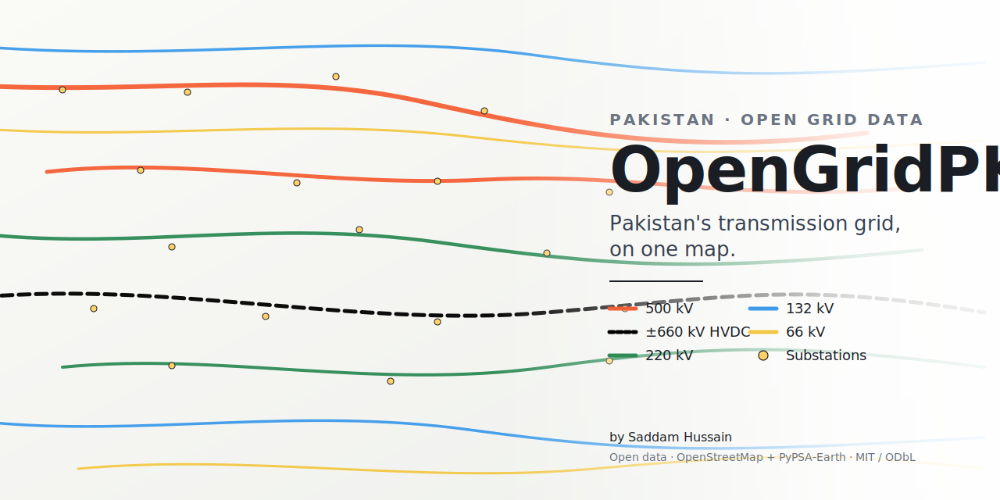

# OpenGridPK

**Pakistan's transmission grid, on one map.**

OpenGridPK is an open, interactive web map of every high-voltage transmission line in Pakistan: 66 kV, 132 kV, 220 kV, 500 kV, and the ±660 kV Matiari–Lahore HVDC link. It is built from public data sources (OpenStreetMap, PyPSA-Earth) and published as a static site so anyone can browse the network, inspect individual lines, and download the underlying GeoJSON for their own work.



---

## Why this exists

Pakistan operates one of the larger transmission systems in South Asia, but its public visualisation is poor. NTDC and the DISCOs publish single-line diagrams as PDFs or JPEGs that are hard to use, hard to compare, and impossible to overlay on any other dataset. The information that *is* available — through OSM, PyPSA-Earth, and a few other sources — is fragmented across tools, none of which target Pakistan specifically.

OpenGridPK was put together to address three concrete needs:

1. **A single, navigable view of the high-voltage network.** Layered by voltage class, with substations and utility-scale generation plotted on the same canvas.
2. **A reusable open dataset.** The pipeline emits clean GeoJSON files that can be loaded into QGIS, fed into a PyPSA model, or analysed in a notebook without any further processing.
3. **An honest baseline.** Most other PK grid maps either silently drop lines they can't classify or pretend to have data they don't. OpenGridPK only displays lines whose voltage can be verified against OSM tags or upstream relations; everything else is dropped rather than misrepresented.

The intended audience is broad: power-systems engineers, researchers, energy journalists, students, and anyone curious about the grid that delivers their electricity.

---

## What's on the map

### Lines

| Class | Source | Notes |
| --- | --- | --- |
| 500 kV | OSM `power=line` with `voltage=500000` (and variants) | Backbone of the NTDC system |
| ±660 kV HVDC | OSM `power=line` with `frequency=0` | The Matiari–Lahore HVDC link |
| 220 kV | OSM `power=line` with `voltage=220000` | NTDC sub-transmission |
| 132 kV | OSM `power=line` with `voltage=132000` | DISCO-level high voltage |
| 66 kV | OSM `power=line` with `voltage=66000` | Mostly K-Electric and legacy WAPDA |

### Points

- **Substations** — every `power=substation` element in the country.
- **Generation plants** — every `power=plant` element, filtered to remove distributed energy resources. A plant is kept if it has either (a) `plant:output:electricity ≥ 5 MW`, or (b) both a `name` and a `plant:source` tag (i.e. a named utility-scale facility). This drops thousands of rooftop solar and household-scale installations that aren't relevant to a transmission view.

---

## Methodology

The pipeline is a small Python project under `pipeline/`. End to end, one rebuild does the following:

1. **Fetch.** Issue three Overpass API queries:
   - all `power=line`/`minor_line`/`cable` ways inside the PK admin boundary,
   - all `power=substation` elements,
   - all `power=plant` elements,
   - and (separately) all `type=route route=power` relations, used for voltage propagation.

2. **Parse and normalise voltages.** OSM voltage tags are inconsistent — values appear with units, with typos (`"220kw"` for 220 kV is real), with semicolons for multi-circuit lines (`"220000;132000"`), and sometimes not at all. `pipeline/voltage_parser.py` accepts these variants and produces a clean list of integers in volts.

3. **Snap to canonical classes.** Each parsed voltage is matched against the canonical class set (500/220/132/66 kV plus 660 kV HVDC) within a ±5 % tolerance, so a `230000` mistag still reaches the 220 kV layer. HVDC requires `frequency=0`; AC mistags at 660 kV are *not* shown as HVDC.

4. **Propagate from relations.** Where a line lacks a voltage tag but is a member of a `route=power` relation that has one, the relation's voltage is inherited. This recovers a few dozen lines that would otherwise be discarded.

5. **Apply local overrides.** Hand-curated corrections in `data/overrides/` are merged on top:
   - `voltage_corrections.json` — `{osm_way_id: corrected_voltage_v}`
   - `name_corrections.json` — `{osm_way_id: canonical_name}`
   - `add_lines.geojson` — entirely manual additions where OSM has no geometry at all
   Each output feature carries a `source` property (`osm`, `osm-relation`, or `override`) so the click popup attributes the data accurately.

6. **Validate.** Geometries must be valid LineStrings with at least two points; voltages must agree with the bucket they landed in; aggregate length and feature count are compared with the previous build, with a warning if any class drifts by more than ±20 %.

7. **Simplify and write.** Geometries are simplified with a Douglas–Peucker tolerance of about 50 m to keep web payloads small (every voltage GeoJSON is well under 1 MB uncompressed). Files are written to `site/data/` along with a `meta.json` containing build timestamp, line counts, and lengths.

The static site (`site/`) is plain HTML/CSS/JS using MapLibre GL JS over a CartoDB Positron basemap. Layer toggles, click popups, mobile-friendly legend, and feature counts are wired up in `site/app.js`. There is no backend, no database, and nothing to host beyond the static files — the entire site fits comfortably on GitHub Pages.

---

## Limitations

These are deliberately written up so that consumers of the data understand exactly what they are looking at.

- **OSM is the floor, not the ceiling.** The map is no more complete than OSM coverage for Pakistan. As of this build, OSM has ~1,300 transmission-class line segments without a voltage tag. These are dropped — they are not silently classified into a default voltage. If you spot a missing line you can identify, the right fix is either to tag it on osm.org or to add an entry to `data/overrides/`.

- **No 765 kV layer.** Pakistan has under-construction 765 kV infrastructure (Matiari–Moro), but as of the current data refresh nothing in OSM is tagged at that voltage. Once tagging exists, the class can be re-introduced in `data/reference/voltage_classes.json` and the next refresh will pick it up automatically.

- **Substations are points, not polygons.** Substation switchgear extents in OSM are inconsistent — some are mapped as polygons, others as nodes. They are all collapsed to a single point (centroid for ways/relations) for legibility at the country zoom level.

- **Generation list is utility-scale only.** The DER filter intentionally drops rooftop solar and household-scale hydro. If your interest is rooftop adoption rather than the bulk system, this is not the dataset to use.

- **Operator/owner attribution is incomplete.** OSM tagging for `operator` is sparse on PK power infrastructure. Where a popup says "Operator: —", the data was not present upstream.

- **Snapshot, not real-time.** The map shows topology, not state. There is no SCADA, no line loading, no alarms, no contingency. Data refreshes monthly via a scheduled GitHub Actions job; the "Last refreshed" line in the legend tells you exactly when the current view was built.

---

## Repository layout

```
opengridpk/
├── README.md
├── LICENSE                     MIT for code; ODbL for derived data
├── LOCAL_SETUP.txt             How to run the pipeline + site locally
├── docs/
│   └── social-card.svg         Repo preview image
├── .github/workflows/
│   └── refresh-data.yml        Monthly auto-rebuild
├── pipeline/                   Python build code
│   ├── pyproject.toml
│   ├── Makefile
│   ├── pipeline/               (source)
│   └── tests/                  (pytest)
├── data/
│   ├── overrides/              Hand-curated corrections (see its README)
│   └── reference/
│       └── voltage_classes.json    Canonical voltage classes (read by both the pipeline and the site)
└── site/                       Static MapLibre GL site (deployed via GitHub Pages)
    ├── index.html
    ├── style.css
    ├── app.js
    └── data/                   ← generated by the pipeline; committed
```

---

## Running it locally

See `LOCAL_SETUP.txt` for the exact step-by-step. In short: create a venv under `pipeline/`, install the package in editable mode, run `make refresh` to build the GeoJSON, then `make serve` to view the site at `http://localhost:8000`.

---

## Contributing data corrections

If you spot a wrong voltage, a missing line, or a mis-named substation:

1. **First choice — fix it on OpenStreetMap.** Edits there benefit every consumer of OSM, not just this map, and they will flow into the next monthly refresh automatically.

2. **Second choice — open a PR against `data/overrides/`.** See `data/overrides/README.md` for the file formats. Cite a source for the correction (NTDC document and page, observed installation, photograph, etc.). One PR per logical correction; don't bundle unrelated edits.

---

## Data sources and attribution

- **OpenStreetMap contributors** — line geometries, substation locations, generation plant locations. Licensed under [ODbL](https://www.openstreetmap.org/copyright).
- **PyPSA-Earth** — referenced as a topology baseline. Licensed under MIT. <https://pypsa-earth.readthedocs.io/>
- **CARTO** — Positron basemap tiles. <https://carto.com/attributions>
- **MapLibre GL JS** — open-source map renderer.

Inspiration: [OpenInfraMap](https://openinframap.org/) and [OpenGridWorks](https://opengridworks.com/).

---

## Licence

- **Code** in this repository — MIT. See [LICENSE](LICENSE).
- **Derived data** in `site/data/` — ODbL, inherited from OpenStreetMap. You may reuse the GeoJSON freely provided you attribute "© OpenStreetMap contributors" and share-alike any derived database.

---

## Author

Built and maintained by **Saddam Hussain**. Issues and pull requests are welcome.
